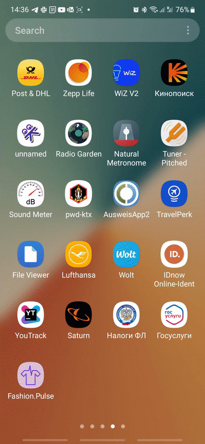

# fashion.pulse
<!-- Badges -->

## Stylish Introduction

The project provides a service that **_evaluates how fashionable an outfit on the image is_**. The fashion score is given for 20 different styles.

To try the app by yourself check the [Releases](https://github.com/DLochmelis33/fashion.pulse/releases) section!

### This repo includes
* *FastAPI* server and *Android* app implementation;
* *PyTorch Lightning* model to evaluate images' score;
* `img_fashion_styles` dataset gathered from *Pinterest*;
  
...and, of course, a developed infrastructure to reproduce our results and conduct further experiments.

### Table of contents
- [fashion.pulse](#fashionpulse)
  - [Stylish Introduction](#stylish-introduction)
    - [This repo includes](#this-repo-includes)
    - [Table of contents](#table-of-contents)
  - [Detailed repo structure](#detailed-repo-structure)
  - [Train model \& deploy server](#train-model--deploy-server)
  - [Infrastructure methods overview](#infrastructure-methods-overview)

## Detailed repo structure

## Train model & deploy server

## Infrastructure methods overview